## Upgrade Instructions

#### Export User Settings and App User Settings from Dataverse

1. Go to the **Power Apps Maker Portal**

1. **Select Solutions**

1. **Select the ellipsis** next to **ALM Accelerator for Advanced Makers** and **Select Edit**
   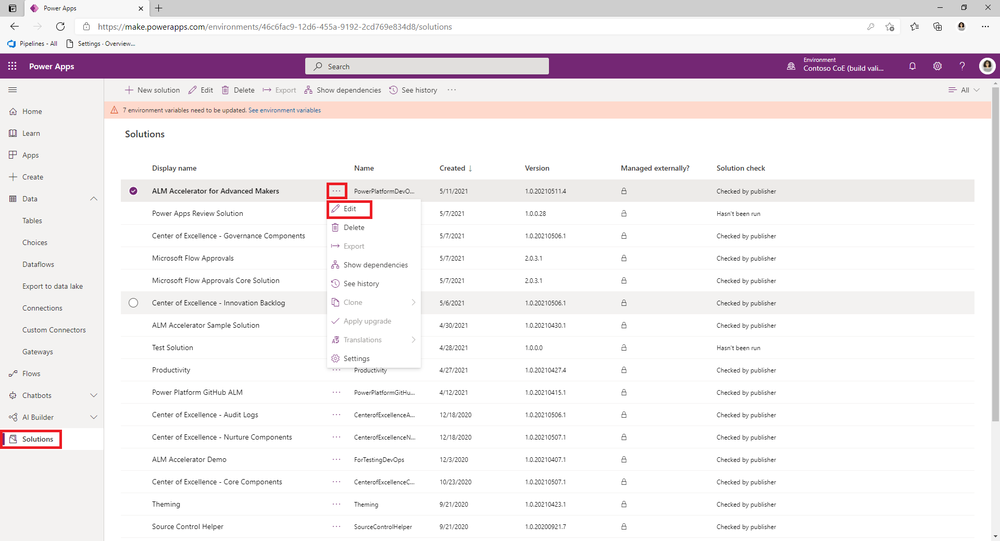
   
1. Select the **App User Settings** Table and **Select Data**
   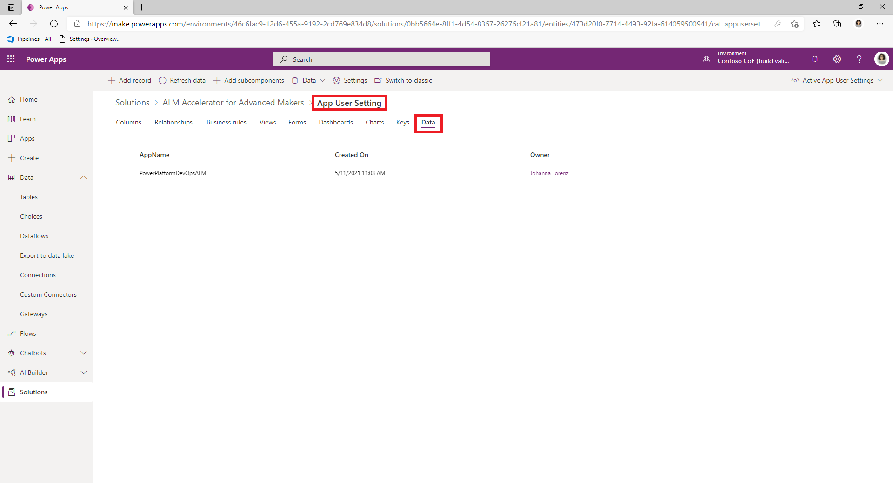
   
1. **Select Data** from Menu and **Select Export Data**
   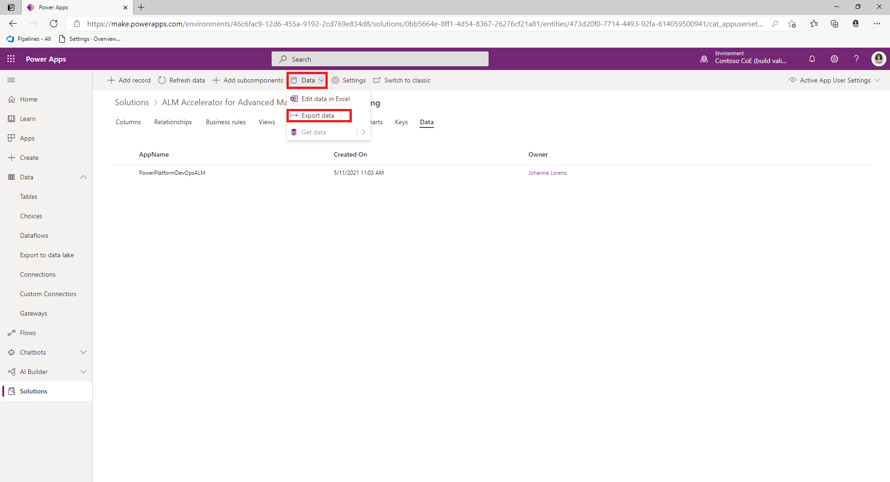
   
1. Wait for the Export to Complete and **Select Download exported data**
   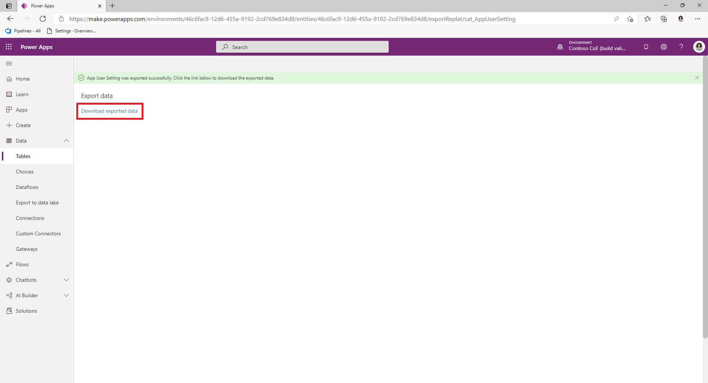

1. **Repeat the steps above** to Export the data for the **User Setting table**

#### Delete Managed PowerPlatformDevOpsALM Solution

1. In the Maker Portal **Select Solutions**

1. **Select the ellipsis** next to **ALM Accelerator for Advanced Makers**, **Select Delete**

   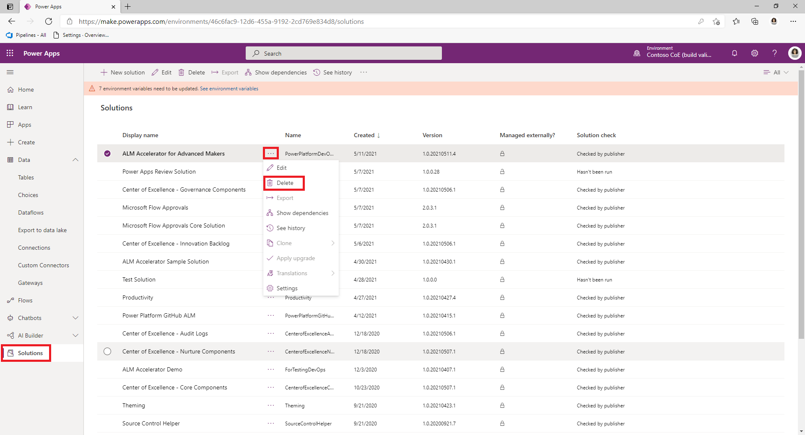

3. Confirm you want to **Delete the Solution**

   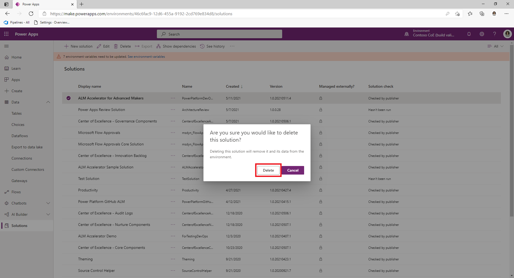

#### Import Managed ALMAcceleratorForAdvancedMakers Solution

1. Download the latest Managed Solution from Releases in GitHub https://github.com/microsoft/coe-starter-kit/releases

1. In the Maker Portal **Select Solutions** and **Select Import**

1. Browse and Select the **File you just downloaded** and **Select Next**

   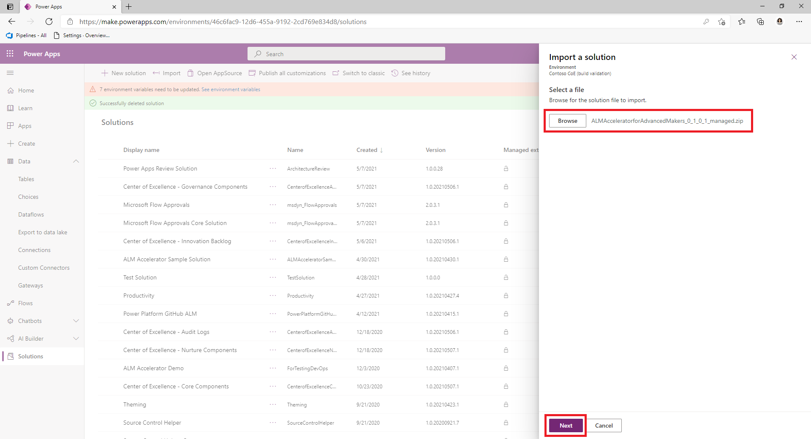

1. **Select Next** on the following screen and **Select or Create a Connection for the Connection Reference**

1. **Select Import**

   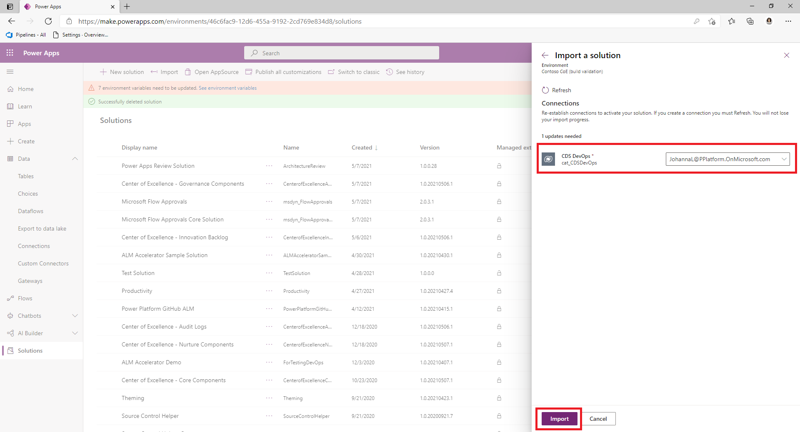

#### Import User Settings and App User Settings into Dataverse

1. **Extract the .csv files from the .zip files** you downloaded during the Export steps

   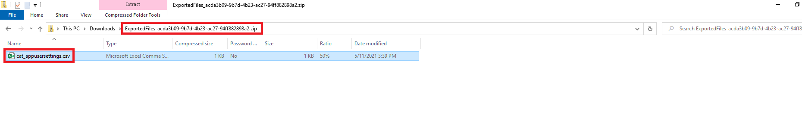

1. **Select the ellipsis** next to **ALM Accelerator for Advanced Makers** and **Select Edit**
   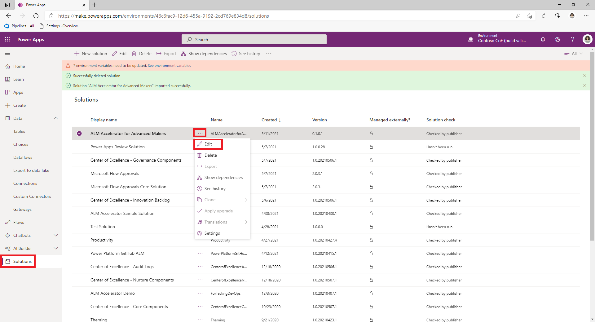

1. Select the **App User Settings** Table and **Select Data**
   

1. **Select Data** from Menu and **Select Get Data** then **Select Get data from Excel**

   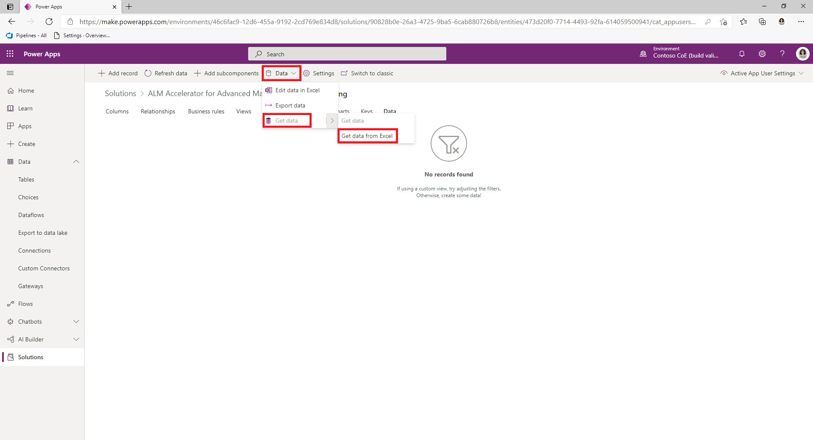

4. **Browse to the .csv file** you extracted from the .zip for this Table and **Select Import**

   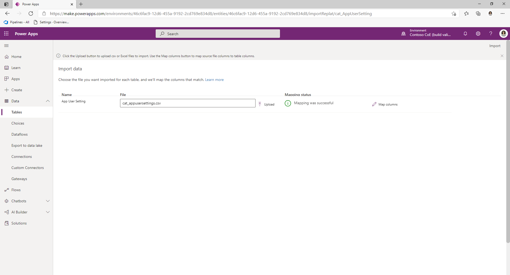

5. **Repeat the steps above** to Import the data for the **User Setting table**